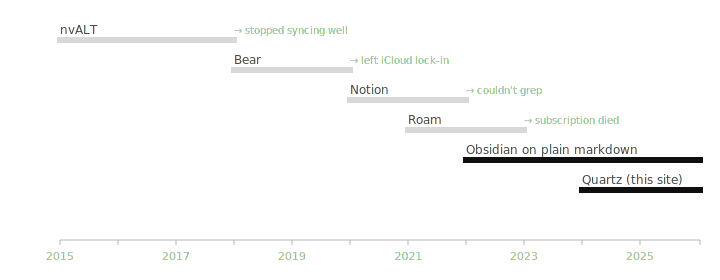

I tried a lot of writing tools. Most of them I stuck with for six to eighteen months before quitting. Looking back at the timeline, the pattern is embarrassingly clear.

The light bars are dead. The dark bars are still in use. Two things stand out:

1. **Every tool I quit was killed by the same thing**: I couldn't get my data out cleanly, or I couldn't grep it, or the company stopped maintaining the format.
2. **The two tools I kept are both plain text under the hood.** Obsidian is a markdown editor. Quartz is a markdown publisher. The lock-in surface is zero.

There's a meta-lesson here that took me a decade to internalize: **the format outlives the application**. If your data is in plain markdown, you can change apps every year and not lose anything. If your data is in someone else's database, you are renting your past.

I'm not against rich tools. I use spreadsheets. I use a calendar app. But for the long-form, slow-thinking work — the kind that needs to be readable in 2035 — every "feature" is a future migration risk.

The honest version of "I tried that productivity app" is usually: "I exported the data three years later, and most of it had quietly stopped opening." This was true for Bear (good while it worked), Roam (subscription evaporation), Notion (export was technically markdown but practically not), and three others I'm not naming because the wound is fresh.

The list of things I haven't quit, after a decade:

- Plain markdown files in a flat folder
- Git for backup
- `ripgrep`
- A serif font and a wide enough window

Related: [[en/posts/plain-text-notes-after-a-decade]], [[en/notes/why-i-distrust-productivity-systems]], [[en/notes/plain-text-everything]].
