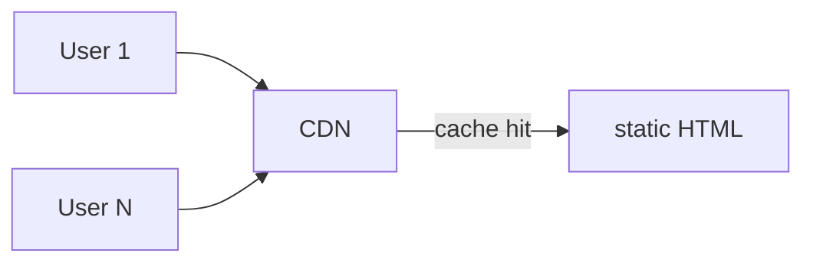
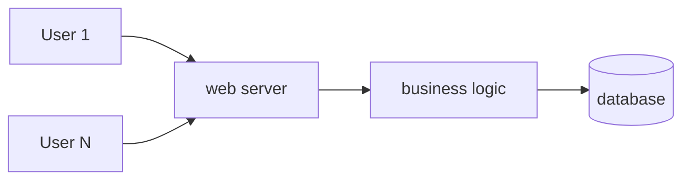

I run 12 websites. 10 are static.

## The math

A static site's server cost is **O(1)**, not O(users). The CDN caches one HTML file, and 10 users vs 100,000 users do roughly the same work on your origin.

A dynamic site runs business logic per request, hits the database, allocates memory. Scaling up means your DB becomes the bottleneck, then CPU, then RAM, then bandwidth.

vs

## Maintenance

A static site's maintenance is **only when content changes**. Code stays still. Dependencies stay still.

I have a static site deployed in 2019, untouched since. It gets a few thousand visits a month. I have never logged into an admin panel.

A dynamic site needs patches, runtime upgrades, DB tuning, monitoring, spam handling. Each is a recurring cost.

## What it can't do

Honestly:

- **Per-user state**: comments, likes, follows. I outsource that to [[en/posts/why-i-deleted-twitter|GitHub via Giscus]].
- **Personalization**: every user sees the same page
- **Real-time data**: prices, chat, collaboration
- **Mobile-first authoring**: you can't "post quickly from your phone" — you need a local editor and `git push`

## When to go dynamic

| Yes | No |
|---|---|
| Multi-user collab tools | Personal blog |
| Real-time data apps | Documentation site |
| Complex transactions | Marketing pages |
| Backend RBAC | Landing pages |

99% of "blogs" don't need dynamic. Same for docs and portfolios.

## This site

[[en/notes/xie|This page]] documents the stack. Source on GitHub, Cloudflare builds it, CDN serves it. I wrote thirteen pieces this week — pipeline never blinked.

In ten years I'll have switched hosts three times. The Markdown files will still be in the git repo.
