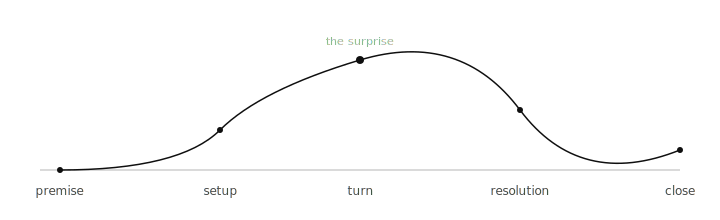

When an essay isn't working, the problem is almost never the sentences. The problem is the **shape**.

A good essay has the same shape every time. It's not the five-paragraph thing they teach in school. That's a container, not a shape. The shape is closer to a curve.

The premise is plain. You don't dress it up. The setup builds a small amount of tension — usually by introducing a fact that doesn't fit, or a question the reader didn't know they had. The **turn** is the surprise. It's the moment the essay becomes more interesting than the topic. The resolution is the reader catching up to where you got. The close is short.

What goes wrong, in my drafts:

- **No turn.** The essay stays at the same altitude the whole way. A reader can finish a no-turn essay and forget it within an hour.
- **The turn is too early.** The setup hadn't built enough yet, and the surprise lands soft.
- **The resolution drags.** The turn was good but you keep explaining it.
- **The close keeps going.** A close should be one sentence. Two if the second one is short.

I look for the turn first when I edit. If the turn is weak or missing, no amount of sentence-level revision will save the piece. Better to throw it back to outline and find the real surprise — or admit there isn't one and not publish.

> A draft without a turn is a topic, not an essay.

This is also why most "I have an idea for a blog post" ideas don't survive contact with the page. The topic is real; the turn isn't there yet. That's fine. Let it sit. Sometimes the turn arrives months later, in a different essay.

Related: [[en/posts/on-the-discipline-of-finishing|On the discipline of finishing]], [[en/posts/three-drafts-ill-never-finish|Three drafts I'll never finish]].
