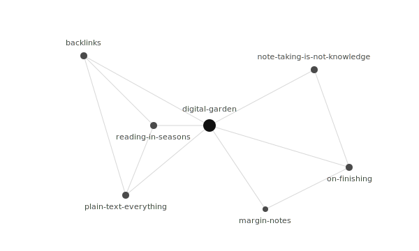

Backlinks are oversold. They are also undersold. Both can be true, because the people doing the selling have different things in mind.

## What backlinks _are_

A backlink is just the inverse of a hyperlink. If page A links to page B, then page B's "backlinks" includes page A. There is nothing magical about this. Wiki software has computed it since the 90s.

## What people _claim_ backlinks do

> "Backlinks make your notes self-organizing."

This is half true. They make your notes self-_indexing_. Self-organization is doing a lot of work in that sentence, and it's not something the data structure can do for you.

## What backlinks actually do

Three useful things:

1. **They tell you when an idea is becoming central.** If three notes start pointing at one note without you planning it, that note is doing real work. Pay attention.
2. **They surface forgotten context.** You wrote about X six months ago. Today you're writing about Y, which (you discover) you'd already connected to X. The backlink reminds you.
3. **They make accidental conversations findable.** The note you wrote in passing turns out to be where the actual interesting argument lived. Without backlinks, you'd never find your way back to it.

## What they don't do

- They don't tell you which links matter. A backlink to your "[[en/notes/digital-garden]]" hub is no more meaningful than the hundredth one.
- They don't summarize. Two notes that link to each other can be saying entirely different things about the same word.
- They don't substitute for writing. The point of a digital garden is the writing; the linking is connective tissue, not the muscle.

The honest version: backlinks are a small, useful, frequently-overstated affordance. Use them. Don't build your tool around them. If the writing is good, the links will be discovered. If the writing is bad, no link graph is going to fix that.
