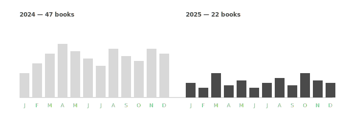

I track my reading. Last year I finished 47 books. This year I finished 22. I don't think I learned less.

This wasn't intentional at first. I started writing more — about three short essays a month, a steady drip of notes — and noticed I was opening fewer new books. The reading I _did_ do was more deliberate: re-reads, slow reads, sources I was working with for a piece. The 22 books were chosen, not consumed.

## What I gave up

Most of it was junk. The popular non-fiction that you read for one good chapter and then never reference. The novels you finish for the sake of finishing. The "I should know about X" reading that's really anxiety in disguise.

What I kept:

- A short list of writers I re-read in seasons (Hazlitt, Berger, Le Guin, Gwern, Sivers — strange company)
- The book I'm currently working _through_ rather than _reading_ (this year: Christopher Alexander's _The Nature of Order_, vol. 1, three times)
- The handful of papers and essays I link to from my own writing

## What writing more taught me

Writing more is a forcing function for noticing what you actually believe. It turns out I believe fewer things than I thought, and the things I do believe are smaller and more specific. Most of my "opinions" were just half-remembered arguments from books I'd read once.

The 22 books I finished this year sit much heavier in my head than the 47 from last year. I can quote from them. I can locate which ideas came from which book. I can disagree with them by name.

> Reading is how you import other people's thinking. Writing is how you find out which of it survived contact with your own.

## What I'd do again

- Two-month reading "seasons" with one anchor book and a handful of supporting essays.
- Writing the half-formed reaction _before_ moving on to the next book.
- A `reading.md` file that's just _what I'm reading now_, updated weekly. No reviews, no stars, no metadata.

## What I'd do differently

- I read too few novels. Fiction is good for the parts of thinking that argument doesn't reach. Two next year felt thin.
- I should have re-read at least one philosophy book I disagreed with.
- I let "I'll write about this" become a substitute for finishing the book.

Cutting reading in half is not a flex; it's a trade. The trade was worth it, but it wasn't free.
