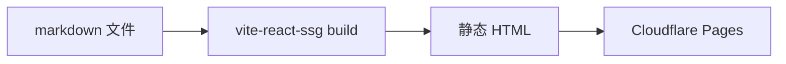

写一篇文章前我会忘记可以用什么。这篇是给我自己看的备忘录。

## Wikilinks

`[[posts/markdown-blog]]` 解析成内部链接（标题用文章的 frontmatter title），可以加显示文本：`[[posts/foo|这里]]`。中英文之间得显式写：CN 文件里写 `[[en/posts/foo]]` 才能跳到英文版。详见 [[notes/digital-garden|数字花园]] 那篇 note。

## Callouts

Obsidian 风格的 `> [!note]`、`> [!warning]` 等。

> [!tip]
> Callout 的 body 里可以正常用 markdown：**加粗**、`代码`、[[posts/markdown-blog|wikilinks]]、列表都行。

## 脚注

写法 `[^1]`，定义 `[^1]: ...`。脚注会汇总到文章末尾[^why-bottom]。

## 数学公式

行内 `$E=mc^2$`、行间 `$$ ... $$`，都走 KaTeX。

## Mermaid 图

构建时 lazy-load，不占主包。

## 旁注

正文里可以塞旁注<aside class="sidenote">在宽屏上浮到右侧 margin。窄屏退化为内联斜体。HTML 直写，rehype-raw 透传。</aside>不是 footnote 的替代，更像 Tufte 边注。

## 系列

frontmatter `series: 名字`，文末自动出 SeriesNav。这篇就属于"写 · 设计笔记"系列。

[^why-bottom]: 不是边注（sidenote 是边注），是经典脚注：链接 → 跳到底 → 看完跳回。
