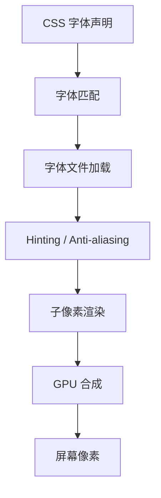

你设了 `font-family: "EB Garamond"`。Chrome 渲染出来的样子和 Safari 不一样。Mac 和 Windows 不一样。手机和电脑不一样。

为什么？

## 渲染管线



每一步都引入差异。

## Hinting

字体设计师会为每个 glyph 写"hint"：在小尺寸下，哪些笔画应该对齐到像素网格、哪些可以反锯齿模糊。

Windows 历史上倾向重 hinting（清晰但失真）。Mac 倾向轻 hinting（柔和但不锯齿）。这就是为什么同一个字体在两个 OS 上"看起来不一样"——不是字体不同，是渲染策略不同。

> [!info]
> 现代趋势是减少 hinting，因为高 DPI 屏幕（>200 ppi）下 hinting 的视觉收益接近零，反而引入计算成本。

## 子像素渲染

LCD 屏幕的每个像素是 R-G-B 三个子像素水平排列。ClearType / Subpixel rendering 利用这一点：让字体边缘的色彩部分用子像素的精度。

代价：字体边缘有微弱的红/蓝/绿"光晕"。在缩放、旋转、半透明叠加时崩。

```css
/* 关掉子像素渲染（适合非 LCD 屏 / 移动端） */
-webkit-font-smoothing: antialiased;
-moz-osx-font-smoothing: grayscale;
```

我这个站设了 `-webkit-font-smoothing: antialiased`，因为 humanist serif 在子像素渲染下看起来有点"沙"。

## Optical Size

[[notes/callouts-and-math|callouts 那一篇]] 提了 Newsreader 用的是带 `opsz 6..72` 的 variable font。这意味着：

$$
\text{glyph at 12px} \neq \text{glyph at 12px scale-down from 72px}
$$

Variable font 内部对每个尺寸有不同的 glyph 设计——大尺寸下笔画对比强、小尺寸下 x-height 高、衬线粗。浏览器自动选最合适的。

不是所有字体都有 opsz 轴。Newsreader 有，EB Garamond 没有。所以同一段 17px 文字，Newsreader 看起来比 EB Garamond"更舒展"。

## 中文渲染特别一点

CJK 字符的笔画密度极不均匀（"一" 一笔，"龘" 48 笔），renderer 必须处理"笔画在小尺寸下融在一起"的问题。

实际策略：

1. 提高最小字号（建议 ≥14px 中文）
2. 增加字间距 (`letter-spacing: 0.01em`)——见 [[posts/cjk-line-breaks]]
3. 选 stroke 对比小的字体（思源 / LXGW，避开宋体在小尺寸用）

## 我做了什么

这个站的最终决定：

| 项目 | 设置 | 理由 |
|---|---|---|
| Font smoothing | antialiased | humanist serif 不需要 ClearType 的尖锐 |
| Optical size | 用 Newsreader 的 opsz axis | 同一字体跨多种尺寸 |
| 字号 | 17px body | 比标准 16px 大一档，给 CJK 留呼吸 |
| Letter spacing | 0.01em CJK | 和拉丁混排的过渡 |

这些不解决所有问题。但是问题清单从 100 缩到了 20。
