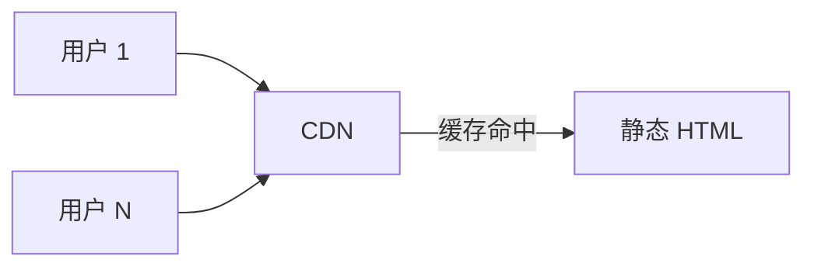
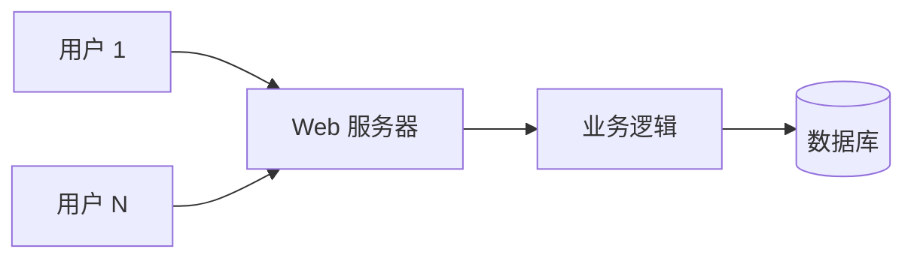

我有 12 个网站还在跑。其中 10 个是静态的。

## 数学

静态网站的服务器成本是 **O(1)** 不是 O(用户数)。CDN 缓存一份 HTML 文件，10 个用户和 10 万个用户的服务端工作量基本一样。

动态网站每个请求都要跑业务逻辑、查数据库。10 万用户意味着你的数据库会成为瓶颈，CPU 会成为瓶颈，内存会成为瓶颈，带宽会成为瓶颈。

vs

## 维护

静态网站的维护成本是**只有内容变化时才有**。代码不动，依赖不动。

我有一个静态网站从 2019 年部署到现在没改过一行代码。它每个月有几千访问。我从不需要登录"管理面板"。

动态网站要打补丁、升级 runtime、调优数据库、监控可用性、处理 spam。每一项都是需要持续投入的成本。

## 它做不到的

诚实地：

- **用户互动**：评论、点赞、关注。我用 [[posts/why-no-comments|Giscus]] 把这部分外包给 GitHub
- **个性化**：每个用户看到不同内容
- **实时数据**：股价、聊天、协作
- **写**：你不能从手机上"快速发个动态"，必须有一个本地编辑环境 + git 流程

## 什么时候值得动态

| 是 | 不是 |
|---|---|
| 多用户协作工具 | 个人博客 |
| 实时数据应用 | 文档站 |
| 复杂交易系统 | 介绍站 |
| 需要后台权限管理 | landing page |

99% 的"博客"没必要动态。99% 的"文档"没必要动态。99% 的"作品集"没必要动态。

## 这个站

[[notes/xie|这个站本身]] 是静态的。源码在 GitHub。Cloudflare 构建。CDN 部署。我这周写完了 13 篇文章——pipeline 没有任何"忙不过来"的迹象。

未来 10 年我换部署服务三次都没问题。文件还在 git 仓库里。
